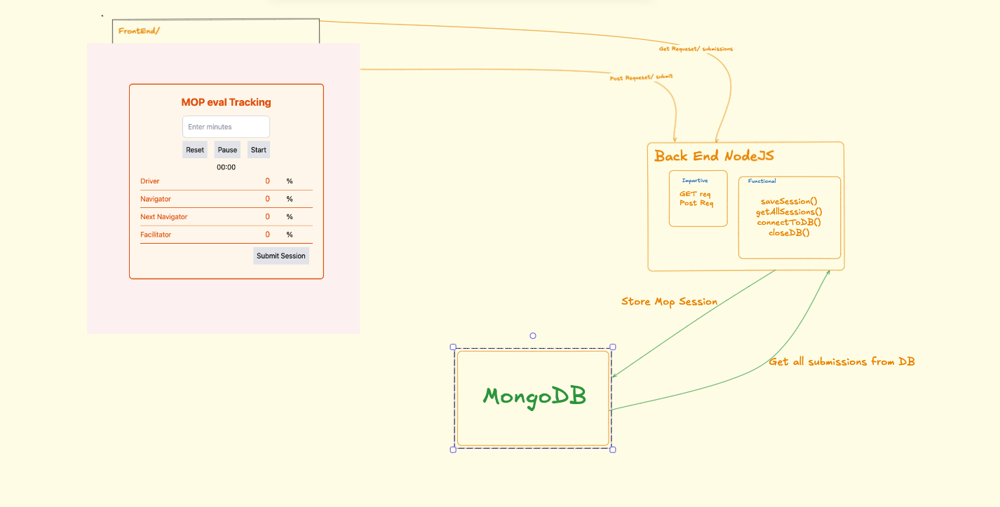

# Fullstack Weekend Project

Here's a basic structure for your README file that covers both the frontend MOP Tracking app and the backend with Node.js that handles two routes (`GET /submissions` and `POST /submit`). This README provides clear instructions for setup, running, and usage.


---

# MOP Evaluation Tracking App

## Overview

This project consists of a frontend MOP Tracking application and a backend server built with Node.js (without Express). The frontend allows users to submit evaluation data for drivers, navigators, next navigators, and facilitators, while the backend processes and stores the submitted data in a MongoDB database and serves it through API routes.

### Table of Contents

- [Frontend Setup](#frontend-setup)
- [Backend Setup](#backend-setup)
- [API Endpoints](#api-endpoints)
- [Usage](#usage)
- [Technologies Used](#technologies-used)
- [link to the planning board](https://excalidraw.com/) installed

---

## Frontend Setup

### Prerequisites

- [Node.js](https://nodejs.org/) installed
- A package manager like npm or yarn

### Getting Started

1. Clone the repository:

   ```bash
   git clone https://github.com/saltsthlm/fullstack-weekend-project-Odin-Taif
   cd mop-eval-tracking/frontend
   ```

2. Install dependencies:

   ```bash
   npm install
   ```

3. Start the development server:

   ```bash
   npm run dev
   ```

4. The application should now be running at `http://localhost:3000`.

### Folder Structure

```
frontend/
  ├── src/                    # React components and logic
  └── build/                  # Production build files (after running `npm run build`)
```

---

## Backend Setup

### Prerequisites

- [Node.js](https://nodejs.org/) installed
- [MongoDB](https://www.mongodb.com/) installed and running locally or cloud-based (e.g., MongoDB Atlas)

### Getting Started

1. Navigate to the backend folder:

   ```bash
   cd ../backend
   ```

2. Install dependencies:

   ```bash
   npm install
   ```

3. Set up environment variables:
   Create a `.env` file in the `backend` folder and add the following:

   ```
   MONGODB_URI=mongodb://localhost:
   PORT=4000
   ```

4. Start the server:

   ```bash
   npm run dev
   ```

5. The server should now be running at `http://localhost:4000`.

### Folder Structure

```
backend/
  ├── src/                  # TypeScript source files
    ├── db/                   # MongoDB connection setup and also funtional core
    └── build/                 # Compiled JavaScript files (after running `npm run build`)
```

---

## API Endpoints

### `POST /submit`

This endpoint is used to submit the evaluation data for the MOP process.

#### Request:

- **Method**: `POST`
- **URL**: `/submit`
- **Content-Type**: `application/x-www-form-urlencoded` or `application/json`
- **Body Parameters**:
  - `driver`: Integer representing the driver percentage.
  - `navigator`: Integer representing the navigator percentage.
  - `nextNavigator`: Integer representing the next navigator percentage.
  - `facilitator`: Integer representing the facilitator percentage.

#### Example Request:

```bash
POST http://localhost:4000/submit
Content-Type: application/x-www-form-urlencoded

driver=80&navigator=60&nextNavigator=70&facilitator=90
```

#### Example Response:

```json
{
  "driver": 80,
  "navigator": 60,
  "nextNavigator": 70,
  "facilitator": 90
}
```

### `GET /submissions`

This endpoint fetches all the stored submission data.

#### Request:

- **Method**: `GET`
- **URL**: `/submissions`

#### Example Response:

```json
[
  {
    "driver": 80,
    "navigator": 60,
    "nextNavigator": 70,
    "facilitator": 90
  },
  {
    "driver": 90,
    "navigator": 80,
    "nextNavigator": 75,
    "facilitator": 85
  }
]
```

---

## Usage

1. Open the frontend in your browser by visiting `http://localhost:8080`.
2. Submit evaluation data for the Driver, Navigator, Next Navigator, and Facilitator in the form.
3. On submission, the data will be sent to the backend and stored in the MongoDB database.
4. The backend can serve all stored submissions through the `/submissions` endpoint.

---

## Technologies Used

### Frontend:

- **HTML5/CSS3**
- **JavaScript/TypeScript**
- **Tailwind CSS**

### Backend:

- **Node.js**
- **TypeScript**
- **MongoDB**
- **HTTP module** (without Express)

---

### Future Enhancements

- Add user authentication and session management.
- Store the time spent on a session.
- Improve form validation with Zod or similar validation libraries.
- Enhance the UI with better error handling and submission feedback.
- Create a dashboard to visualize the submitted data.

---

---

# Fullstack Weekend Project

The primary goal with this project is to show that you can build a simple(!) fullstack application.

A secondary goal is to show how well you can write code by using good function/variable names, good tests, small functions, and overall tidy code.

## Presentation

- You will review another developer's code next week.
- You will present the project next week for the rest of the class.
- The presentation should include a brief overview of the planning done and code structure.
- The presentation should include a code improvement from the code review, and a positive example of high quality code.

## Requirements

1. A public repository on your own github profile with a readme.md and two folders; `frontend/` and `backend/`.
1. A screenshot of a big picture plan in the readme.
1. A link to the planning board in the readme.
1. You should use microsteps with expectations before you code.
1. Any other relevant information in the readme regarding the project idea and choices made.
1. All JS code should be written with TypeScript.
1. An `index.html` file with a form.
1. A server that takes a request from the web client and responds with JSON data.
1. Server code separated into a functional core and imperative shell.
1. The functional core must have unit tests. TDD is highly encouraged.
1. The functional core should not have any side-effects in it.
1. All side-effects should be in the imperative shell.
1. The imperative shell does not need to have any automated tests.
1. The frontend should only trigger the server and show the result. Keep the logic server-side as much as possible.
1. You should incorporate a new technincal concept that you haven't used before. It can be a library, a way of coding, a framework, etc.
1. Document the new technical concept in the readme, together with your learning journey.

## Tips

- Choose a small project idea and small new technical concept. You can always scale it when you are done with the requirements.
- As styling is out of scope for this assignment, you can use https://picocss.com/ to get basic styling without coding CSS.
- Make it work, then improve it.
- Don't be afraid to throw any or all code away and start over with your gained knowledge. Learning is progress!
- If you feel overwhelmed, you can find my phone number on Slack. Please use it, and we can help get you back on track. You are not alone! For smaller issues, you can just DM me on Slack.
- Check your spelling and overall presentational style of the project. This includes git commits and the readme.
- Do not copy code. Write it over in micro-steps. If you copy, you remove learning resistance and might look like you are doing great early in the course, and then you totally fail later in the course.
# WEEKEND-FULLSTACK
